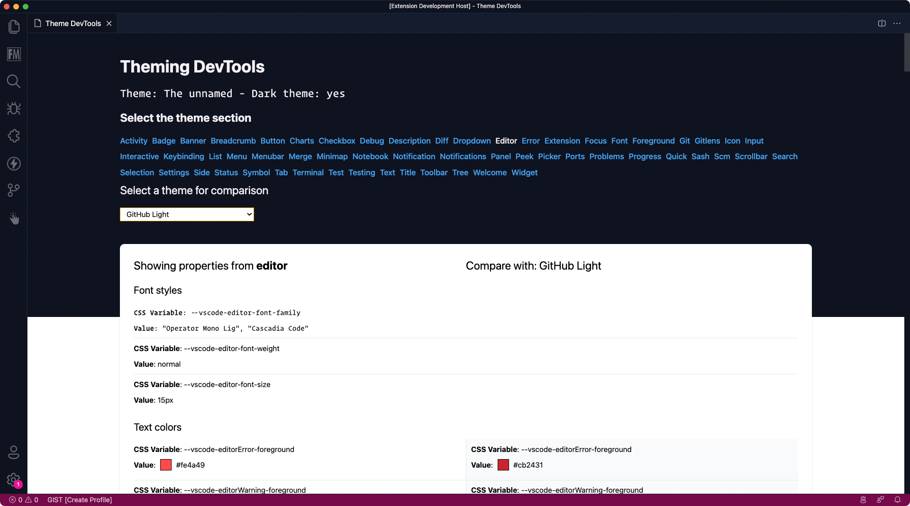

# 💅 Theme DevTools for VSCode

  

  
  
  

  

An extension that helps you out with theming in VS Code. It includes a preview of all the CSS variables and their values. If you are a theme or extension developer, this is a great way to check if your theme is working as expected.

## ⬛️ Dark theme example

  

## ⬜️ Light theme example

  

### ✨ Features

- Show all CSS variables and their values
- On the fly theme changes
- Allow theme comparison with any other theme you got installed

> **Important**: This is limited to the colors defined in the theme. It means that not all colors are provided, but gives you already a good indication of what the theme colors are, and allows you to compare them with other themes.

### 🚀 Usage

1. Install the extension to VS Code
2. Run the `Theming: Open Theme DevTools` command

  

## 🔑 License

[MIT](./LICENSE)

 
 

  

